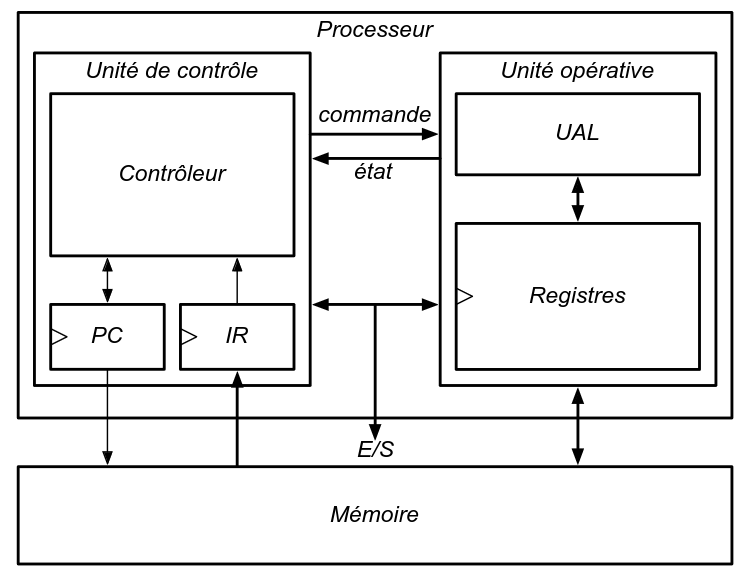

##  1.2. Tentative échouée – CPU 16 bits en VHDL

###  Architecture initiale pour FPGA

Après les premiers tests réussis avec un compteur 8 bits, nous avons tenté d’intégrer un processeur **16 bits** conçu initialement pour une cible **FPGA**.  
Ce CPU a été entièrement écrit en **VHDL**, testé sous **Vivado** (simulation RTL + implémentation sur carte Artix-7).  
Fonctionnel en simulation et en pratique, il exploitait principlement trois modules comme illustré dans le schéma ci-dessous: 
- unité de contrôle.
- unité de traitement.
- mémoire RAM interne(architecture de Von Neumann). 

---

### Problèmes avec la traduction automatique VHDL → Verilog (Yosys)

1. **Première tentative** : implémentation directe du design en **VHDL** dans la template TinyTapeout.  
   TinyTapeout effectue automatiquement une traduction en Verilog en arrière-plan, mais le code généré était **illisible** et **non synthétisable**.

2. **Deuxième tentative** : utilisation manuelle de l’outil **Yosys** pour convertir nous-mêmes le VHDL en Verilog, puis intégration dans la version Verilog du template.  
   Malgré un meilleur contrôle, le **code généré automatiquement restait incompatible** avec les contraintes de synthèse ASIC.

Nous avons utilisé **Yosys** pour convertir automatiquement le code VHDL en Verilog.  
Cependant, la version générée par Yosys posait plusieurs problèmes :
---

#### Limitations rencontrées avec la traduction automatique

Lors de l'utilisation de Yosys pour convertir notre CPU de VHDL vers Verilog, nous avons constaté plusieurs problèmes majeurs :

- **Noms de signaux altérés** : les noms des ports, signaux internes et entités étaient souvent remplacés par des noms génériques (ex. : `_T_19`, `GEN_5`), rendant le code difficile à relire et à déboguer.

- **Structures mal traduites** : les types personnalisés, `std_logic_vector`, `record`, ou encore les `case` imbriqués ne sont pas toujours convertis de manière fidèle.

- **Code non synthétisable** : certaines constructions valides en VHDL (notamment sur FPGA) ne sont **pas compatibles** avec la synthèse OpenLane/TinyTapeout. Cela déclenchait des erreurs lors du `precheck` ou lors de la génération GDS.

- **Lisibilité quasi nulle** : le code Verilog généré était trop bas niveau pour être maintenu ou adapté facilement.

- **Sensibilité à la casse** : contrairement à VHDL, Verilog est **sensible à la casse**. Un code VHDL mal structuré (ex. : `Signal` vs `signal`) peut générer un Verilog invalide ou incohérent lors de la traduction.

- **Conflits avec des mots-clés réservés** : certains identifiants valides en VHDL (comme `byte`, `input`, `case`) peuvent entrer en conflit avec des **mots-clés réservés en Verilog**, ce qui rend la synthèse impossible sans renommer manuellement les ports concernés.

---

#### Pourquoi éviter la traduction automatique (quand possible)

Même si Yosys permet une conversion rapide de VHDL vers Verilog, elle reste limitée dans un contexte **ASIC open source** :

- Le flot de synthèse **n’est pas tolérant** aux approximations syntaxiques.
- Le **débogage devient très complexe**, car il est difficile d'associer les signaux du Verilog généré à la logique initiale.
- Le **contrôle fin de l’architecture** (hiérarchie, timing, nommage) est perdu.

**Remarque** : la réécriture manuelle en Verilog est plus longue mais permet une meilleure compatibilité, maintenabilité, et contrôle sur le résultat final.

*En résumé* : les deux approches automatiques (traduction en arrière-plan et conversion via Yosys) ont échoué à produire un code Verilog synthétisable.  
Seule une réécriture manuelle, adaptée bloc par bloc aux contraintes ASIC, a permis une intégration réussie dans TinyTapeout.
