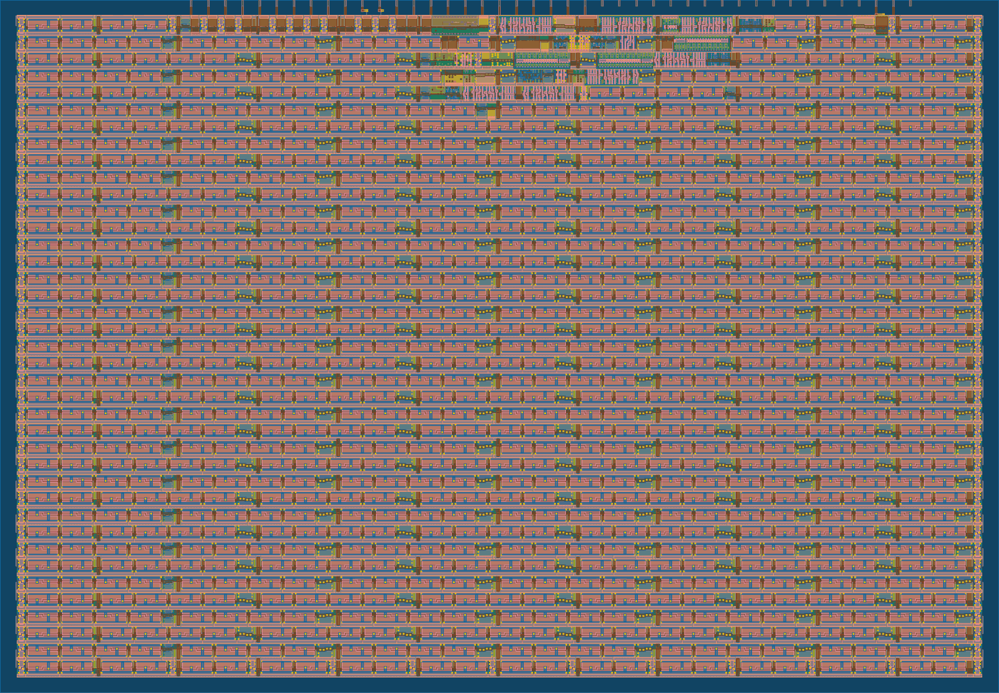

## 2.1.  Résultats : Compteur 8 bits

### Obtention des résultats

Avec le compteur 8 bits précédemment détaillé, nous avons pu observer les résultats dans la partie GDS de "Actions" sur Github.

### Résultats obtenus

GitHub nous donne des informations importantes dans la réalisation d'un ASIC, comme les cellules utilisées, la taille de notre projet sur l'ASIC choisi et même une vue 2D et 3D de notre projet sur l'ASIC:
  - En ce qui concerne l'occupation de notre compteur sur la carte, elle est de 2.633 %. On voit bien que le compteur était un projet simple pour concevoir notre premier ASIC et "se faire la main" sur le sujet.
  - Les cellules utilisées sont :
      - Cellules logiques (NAND, OR, AND...) : 23
      - Cellules combinatoires (flip-flops) : 8
      - Buffers : 5
      - Cellules diverses (constantes, delays) : 18
      - Cellules de remplissage (fill cells) et cellules de connexion (tap cells)
  - La vue 2D du compteur sur la carte est affichée ci-dessous : 

