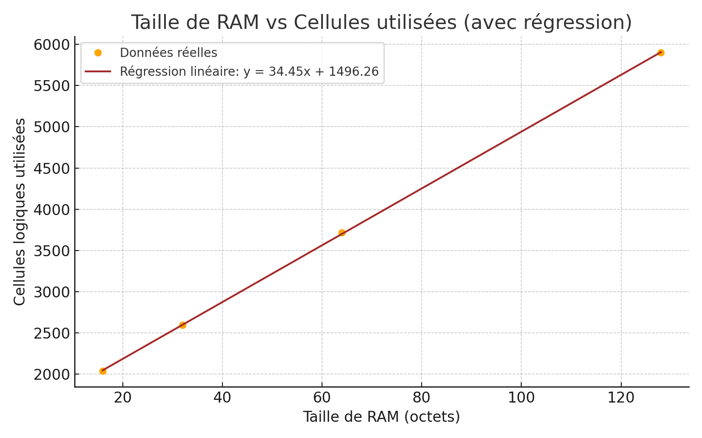

## 2.2.  Résultats du CPU

### Obtention des résultats

De la même manière que pour le compteur 8 bits précédemment détaillé, nous avons pu observer les résultats dans la partie GDS de "Actions" sur Github.

### Résultats obtenus

GitHub nous fournit des informations essentielles pour la réalisation d'un ASIC, telles que les cellules utilisées, la taille de notre projet sur l'ASIC choisi, ainsi que des vues en 2D et 3D de notre projet sur la puce.

Nous avons fait varier la taille de la RAM ainsi que celle de la puce. Nous sommes parti d'une puce de taille maximale: 8x2 ce qui vaut 1336x216 µm(taille modifiable dans info.yaml).
Ainsi on a obtenu les résultats suivants pour notre CPU


| RAM (octets) | Cellules utilisées |
|--------------|--------------------|
| 16           | 2040               |
| 32           | 2595               |
| 64           | 3719               |
| 128          | 5898               |


Grâce à ces valeurs nous pouvons effectuer une régression linéaire du nombre totale de cellules utilisées en fonction de la taille de la RAM en octets:



Avec cette régression nous en tirons une équation liant taille de la RAM et cellules utilisées:
```
Nombre de cellules utilisées = 34.45 x Taille_de_RAM(en octets) + 1496.26
```
Donc on peut estimer la taille de **notre CPU sans RAM: environ 1500 cellules.**


*Remarque*: Pour 16 octets de RAM, on peut voir la proportion de combinatoire et de séquentiel, par exemple, pour 
