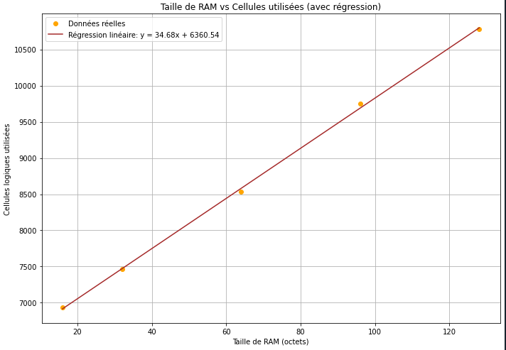

## 2.2.  Résultats et Analyse du CPU RISC_V

### Travail réalisé
Ici des codes en Systme Verilog nous ont été fournis. Il s'agissait d'un CPU RISC V. Après quelques modifications effectuées sur ce code (  ) pour pouvoir basculé le projet sur github, nous avons complété le fichier top.v pour bien associé les signaux et permettre l'utilisation de TInyTapeout.

### Obtention des résultats

De la même manière que pour le compteur 8 bits et le CPU précédemment détaillé, nous avons pu observer les résultats dans la partie GDS de "Actions" sur Github.

### Résultats obtenus

GitHub nous fournit des informations clés pour la conception d'un ASIC, notamment les cellules utilisées, l'empreinte de notre projet sur l'ASIC sélectionné, ainsi que des visualisations 2D et 3D de notre projet sur la puce.

Nous avons fait varier la taille de la RAM.
Ainsi on a obtenu les résultats suivants pour notre CPU


| RAM (octets) | Cellules utilisées |
|--------------|--------------------|
| 16           | 6931               |
| 32           | 7465               |
| 64           | 8530               |
| 96           | 9750               |
| 128          | 10778              |


Grâce à ces valeurs nous pouvons effectuer une régression linéaire du nombre totale de cellules utilisées en fonction de la taille de la RAM en octets:



Avec cette régression nous en tirons une équation liant taille de la RAM et cellules utilisées:
```
Nombre de cellules utilisées = 34.68 x Taille_de_RAM(en octets) + 6360.54
```
Donc on peut estimer la taille de **notre CPU RISC V sans RAM: environ 6 360 cellules.**


Ce petit  travail finam nous a permis de maîtriser la conception d'un CPU RISC-V et d'appréhender l'impact des ressources mémoire sur la taille du circuit intégré. Grâce à l'utilisation de TinyTapeout et GitHub, nous avons observé un gain de temps à la génération des résultats et des visualisations. La régression linéaire nous a permis de prédire le nombre de cellules nécessaires en fonction de la taille de la RAM, offrant ainsi une méthode efficace pour anticiper les besoins en ressources. En somme, cette expérience nous a préparés à concevoir et analyser rapidement des ASICs pour des projets futurs.
