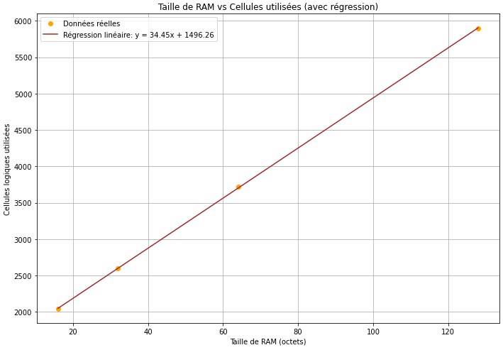

## 2.2.  Résultats et Analyse du CPU

### Obtention des résultats

De la même manière que pour le compteur 8 bits précédemment détaillé, nous avons pu observer les résultats dans la partie GDS de "Actions" sur Github.

### Résultats obtenus

GitHub nous fournit des informations essentielles pour la réalisation d'un ASIC, telles que les cellules utilisées, la taille de notre projet sur l'ASIC choisi, ainsi que des vues en 2D et 3D de notre projet sur la puce.

Nous avons fait varier la taille de la RAM ainsi que celle de la puce. Nous sommes parti d'une puce de taille maximale: 8x2 ce qui vaut 1336x216 µm(taille modifiable dans info.yaml).
Ainsi on a obtenu les résultats suivants pour notre CPU


| RAM (octets) | Cellules utilisées |
|--------------|--------------------|
| 16           | 2040               |
| 32           | 2595               |
| 64           | 3719               |
| 128          | 5898               |


Grâce à ces valeurs nous pouvons effectuer une régression linéaire du nombre totale de cellules utilisées en fonction de la taille de la RAM en octets:



Avec cette régression nous en tirons une équation liant taille de la RAM et cellules utilisées:
```
Nombre de cellules utilisées = 34.45 x Taille_de_RAM(en octets) + 1496.26
```
Donc on peut estimer la taille de **notre CPU sans RAM: environ 1500 cellules.**


De la même manière on peut faire le même travail pour les cellules combinatoires et les cellules séquentielles:  


Avec ça on peut apporter plus de préciser sur notre projet sans RAM, qui contiendrait approximativement 722 cellules combinatoires pour 453 cellules séquentielles et d'autres cellules diverses (delays ou constantes).

La dominance de l'augmentation des cellules séquentielles par rapport aux cellules combinatoires est cohérente avec l'architecture d'un CPU, où les registres et les mémoires internes sont fortement dépendants de la taille de la RAM.


L'analyse combinatoire/séquentielle souligne la prépondérance de la RAM dans l'utilisation des ressources, ce qui est en accord avec l'architecture d'un CPU avec stockage interne.


### Optimisation mémoire

L'optimisation mémoire dans un CPU vise à équilibrer l'utilisation des ressources pour réduire la taille de la puce tout en maintenant des performances adéquates. Nos résultats montrent qu'en augmentant la taille de la RAM, le nombre de cellules utilisées croît linéairement, en particulier pour les cellules séquentielles, liées à la gestion de la mémoire interne. Cette relation souligne l'impact majeur de la RAM sur la consommation de ressources. Réduire la taille de la RAM permet de diminuer les cellules utilisées, mais cela doit être équilibré avec les besoins en stockage du CPU. Ainsi, l'optimisation mémoire consiste à trouver la taille optimale de la RAM pour un compromis entre performance et taille de la puce.
